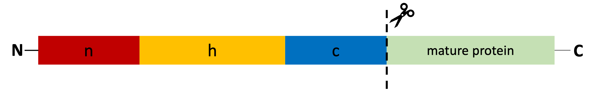
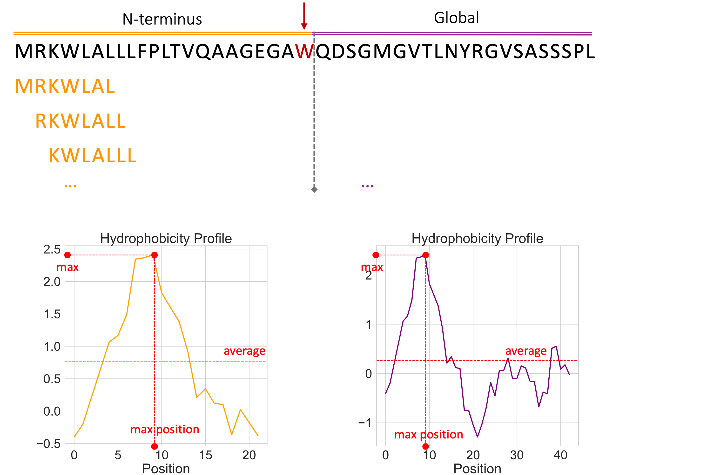

# SignalPeptide-SVM

This repository contains all the materials for the final project of the course Laboratory of Bioinformatics 2 of the MSc Bioinformatics - University of Bologna (AY 2023-2024). 
The projects consists in implementing two different methods for the **identification of signal peptides in eukaryotes**: 
* A position-specific weight matrix (**PSWM**) method, that traces one of the earliest approaches (von Heijne, 1986)
* A Support Vector Machine classifier (**SVC**) that incorporates features encoding characteristics of both the SP sequence and the broader protein context

In both cases, hyperparameters are optimized trough a **5-fold cross-validation** procedure and the final models are benchmarked on a **hold out test set**. 

All the details can be found in D'Onofrio-lb2-prj.pdf. Below the most essential concepts are outlined.

## 1. INTRODUCTION
### Signal Peptides
Signal peptides (SPs) are short amino acid sequences that act as molecular "zip codes," directing proteins to the secretory pathway. A typical SP consists of 15–30 residues and exhibits a tripartite structure:

*   **N-region:** A positively charged domain (1–5 residues).
*   **H-region:** A hydrophobic core (7–15 residues). It is the cardinal element of the SP. 
*   **C-region:** The region flanking the cleavage site (3–7 residues).

Signal peptide prediction is one of the earliest challenges in the bioinformatics field. Distinguishing SPs from N-terminal transmembrane helices or transit peptides, which also contain hydrophobic regions (though of different lengths), is a key difficulty. Furthermore, the variability of the cleavage site sequence, particularly in eukaryotes, adds complexity to accurate cleavage site prediction.

### Objective of this project
This project implements an **SVC** for SP prediction in eukaryotes. The model **incorporates features encoding characteristics of both the SP sequence and the broader protein context**, aiming for a more comprehensive prediction. The SVC's performance is compared to that of a PSWM method based on von Heijne's (1986) approach. 
A 5-fold cross-validation procedure was implemented to optimize the hyperparameters: the threshold in the case of the von Heijne's method and C,gamma and K in the case of the SVC.
Benchmarking on the same blind test set demonstrated the superior performance of the SVC, achieving an **MCC of 0.89**, with higher sensitivity and precision compared to the PSWM.

## 2. DATASET 
A dataset of eukaryotic proteins was obtained from UniProtKB/SwissProt (release 2023_04). The dataset includes:

* **Positive set (SP proteins)**: 2942 proteins with experimentally verified signal peptide cleavage sites (excluding those with unclear or early cleavage sites).
* **Negative set (non-SP proteins)**: 30011 proteins with experimental evidence of localization in cellular compartments not associated with the secretory pathway.
* 
All proteins in both sets are longer than 30 amino acids.

## 3. METHODS
### 3.1 von Heijne method 
A Position-Specific Scoring Matrix (PSWM) of length *L*=15 was constructed from a set of *N* aligned signal peptide sequences. The matrix was populated as follows:

Mk,j = (1 / (N + 20)) * (1 + Σ I(si,j = k))

Where:

*   *Mk,j* is the score for amino acid *k* at position *j*.
*   *si,j* is the amino acid at position *j* in sequence *i*.
*   *k* represents each of the 20 standard amino acids.
*   *I(si,j = k)* is an indicator function (1 if *si,j* equals *k*, 0 otherwise).
*   `+1` represents the added pseudocount to avoid zero values.
*   *N* + 20 is the normalization factor, accounting for the *N* sequences and the 20 pseudocounts (one for each amino acid).

The PSWM was then corrected for background amino acid frequencies (*bk*) from UniProtKB-SwissProt, and log-transformed:

Wk,j = log(Mk,j / bk)

Where:

*   *Wk,j* is the final score for amino acid *k* at position *j* in the PSWM.
*   *bk* is the background frequency of amino acid *k*.

To score a new sequence, a sliding window of length 15 was used, scanning up to the 75th residue (90-15). The score for each window *X*(X1, ..., X15) was calculated as:

score(X) = Σ WXj,j

Where:

*   *Xj* is the amino acid at position *j* in the window *X*.

The maximum score across all windows for a given sequence was used for classification. A threshold was then applied: sequences with a score greater than or equal to the threshold were classified as SP proteins, while those with lower scores were classified as non-SP proteins.

To define an optimal threshold, a 5-fold cross-validation procedure was implemented, ensuring that all the subsets had the opportunity to explore each role. At the end of the cross-validation, the optimal threshold to use in the benchmarking phase was obtained by averaging the 5 thresholds obtained from the individual runs. Upon completing the threshold optimization procedure, the PSWM was computed on the entire training dataset and the performance benchmarked on the blind set.

### 3.2 Support Vector Machine
Each sequence is encoded as a vector, whose dimension depends on the number of features selected. As a baseline vector, a 20-dimensional vector containing the frequency of each residue at the N-terminus (‘Ncomp’) is adopted. This baseline vector can be extended with the following additional features:
* Global composition (‘gcomp’): frequency of each residue starting from the Kth position until the end.
* Hydrophobicity (‘hp’): this feature has been extracted using a sliding window of 7 until K and the hydropathicity scale of Kyte and Doolittle (Kyte and Doolittle, 1982).
* Global hydrophobicity (‘ghp’): the profile is computed adopting a sliding window of 7 and the same propensity scale adopted for ‘hp’ (Kyte and Doolittle, 1982).
* Charge (‘ch’) = the scale is structured such that positively charged residues have value 1 and the other residues have a value equal to 0. The sliding window adopted for the extraction
  was of length equal to 5.
* Helix tendency (‘ht’): the profile is computed adopting a sliding window of 7 that slides until K, the scale adopted is the one developed by Chou and Fasman (Chou and Fasman, 1978).
* Transmembrane tendency (‘tmt’): it is encoded using the Zhao and London scale (Zhao and London, 2006) and a sliding window of length 7

For all these features but global composition, the average value, the maximum value, and the position of the maximum value are extracted (see figure below) and normalized within the range [0,1].

